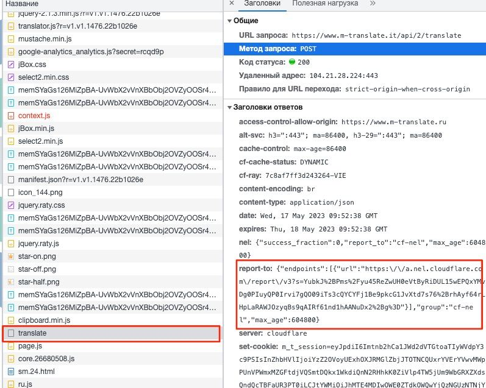

CloudFlare

## links:
- Как переписать Cloudflare https://www.capsolver.com/es/blog/Cloudflare/%D0%9A%D0%B0%D0%BA-%D1%80%D0%B5%D1%88%D0%B8%D1%82%D1%8C-Cloudflare
- Как решить Cloudflare Turnstile https://www.capsolver.com/es/blog/Cloudflare/%D0%9A%D0%B0%D0%BA-%D1%80%D0%B5%D1%88%D0%B8%D1%82%D1%8C-Cloudflare-Turnstile
- Chrome Headless против cloudflare JS challenge https://habr.com/ru/articles/716434/
- Парсим сайты с защитой от ботов https://habr.com/ru/articles/710982/
- Обход Cloudflare Challenge c Puppeteer и нашим API
- How To Bypass Cloudflare in 2023 https://scrapeops.io/web-scraping-playbook/how-to-bypass-cloudflare/[note
- How to Bypass Cloudflare in Python https://www.zenrows.com/blog/bypass-cloudflare-python#what-is-cloudflare-bot-manager
- https://youtu.be/Zd-x1I8FdYc
- https://github.com/ultrafunkamsterdam/undetected-chromedriver
- https://pypi.org/project/cloudscraper/


- https://pypi.org/project/undetected-chromedriver/2.1.1/

## WEB Парсинг на Python https://t.me/python_parsing

### https://t.me/python_parsing/28432
    Попробуйте так:

    import undetected_chromedriver as uc
    from webdriver_manager.chrome import ChromeDriverManager

    driver = uc.Chrome(ChromeDriverManager().install(), options=options)

### https://t.me/python_parsing/25395
- Требуется помощь. Мозг уже сломан. Есть сайт: https://www.m-translate.ru/translator/english/ru-en/free. И есть 
задача через него переводить онлайн. Использую Selenium. Алгоритм: открываю, вставлю, нажимаю GO, скролю до 
образовавшегося ниже окна, забираю результат через XPATH: '//textarea[@id="text"] . Печатаю в терминал текст - 
пусто! Пыталась найти решение борьбы с  "невидимым текстом". Ничего не помогает: 1) пробовала забирать текст через 
get_property('textContent')|get_property('innerText') - пусто. 2) использовала stealth (говорят, помогает 
маскироваться)  - пусто. 3) даже уже извратилась: нажала на кнопку Copy над окном результата, открыла новую 
вкладку Гугл, вставила туда скопированное, нажала поиск, забрала результат из поисковой строки - пусто. Не понимаю 
в чем дело. Может, кто сталкивался с таким и имеет решение?
   
  - Не берусь утверждать, но мне кажется у них на сайте стоит защита cloudflare и из-за этого проблемы.
    Тут надо при запросе к сайту передавать фингерпринт браузера, может помочь.
    Можете также попробовать из ответа вот этого запроса забирать перевод
  - 

### https://t.me/python_parsing/23403
- Прошу совет! При входе на сайт с использованием селениум и прокси, в адресной строке появляется надпись (Не 
защищенное соединение) и я так подозреваю из за этого срабатывает защита cloudflare . Без впн через селениум 
пропускает без проблем. В чем может быть проблема и как победить?
- Для прокси исполтзуешь seleniumware? Там нужно сгенерит  сертификат и добавить в браузер. 
- python -m seleniumwire extractcert Потом импортируй в браузер и все

### https://t.me/python_parsing/22838
интересную штуку нашел.  https://github.com/yifeikong/curl_cffi  и не нужен сенелиум чтоб прятаться от cloudflare

### https://t.me/python_parsing/7907
Бывают сайты которые не хотят отдавать ответ без авторизации с сертификатом CA.
Решается так:

```python
class TLSAdapter(requests.adapters.HTTPAdapter):
    def init_poolmanager(self, *args, **kwargs):
        ctx = ssl.create_default_context()
        ctx.set_ciphers('DEFAULT@SECLEVEL=1')
        kwargs['ssl_context'] = ctx
        return super(TLSAdapter, self).init_poolmanager(*args, **kwargs)

session = requests.Session()
session.mount('https://', TLSAdapter())

response = session.request("GET", url=url, headers=HEADERS)
```

### https://t.me/python_parsing/7875
```python
import time
import undetected_chromedriver as uc
urls = 'https://leroymerlin.ru/product/panel-svetodiodnaya-dvo-6577-p-40-vt-595x595-mm-6500-k-ip20-85396310/'

if __name__ == '__main__' :
    driver = uc.Chrome(version_main=105)
    driver.get(urls)
    time.sleep(5)

```
